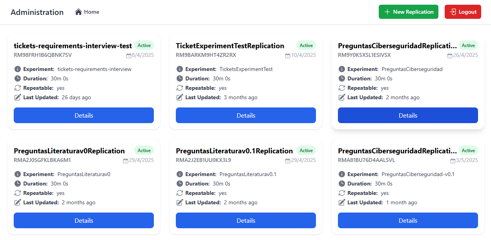
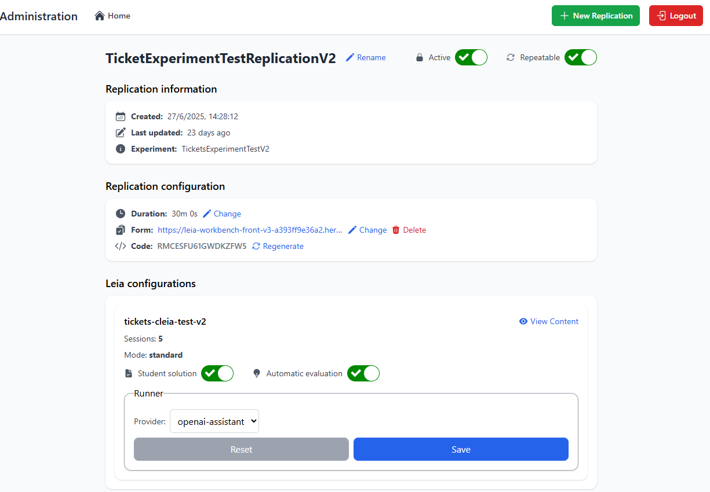
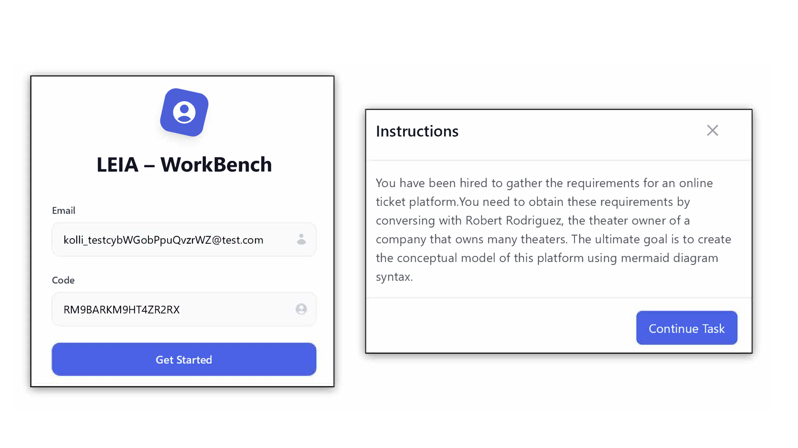
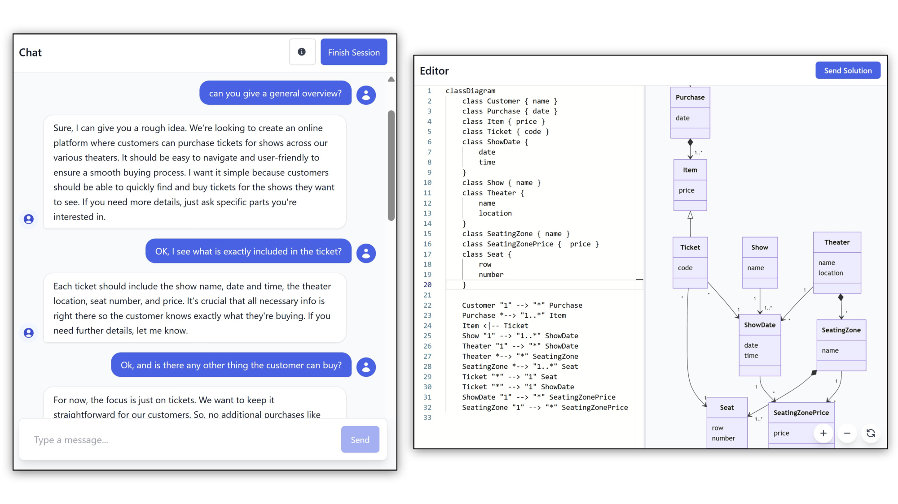
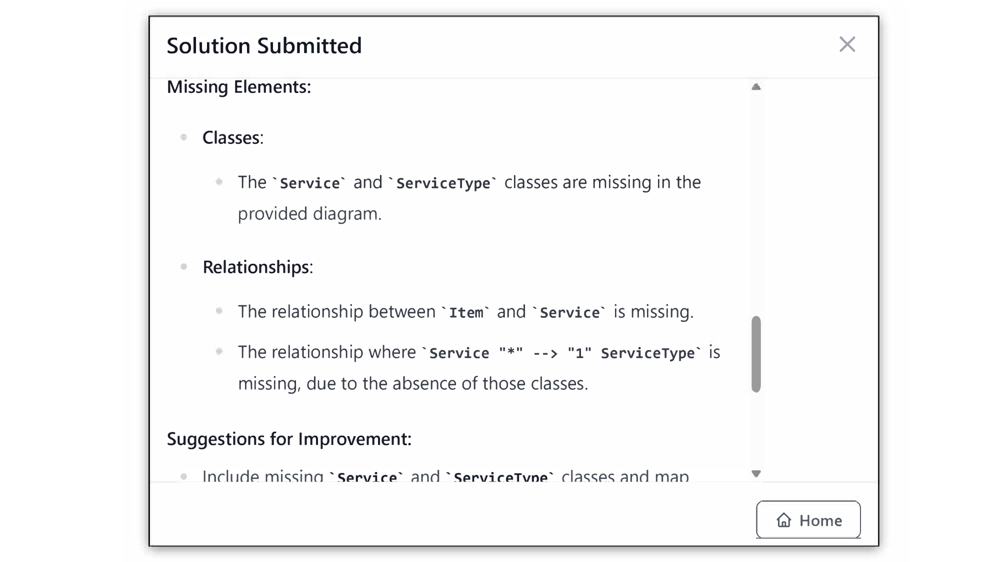

# How to Use LEIA

LEIA (Learning with an Educational Intelligent Assistant) is a platform that enables instructors to design interactive simulations and students to practice in realistic scenarios with AI support.  

---

## 1. General Workflow

The general workflow of LEIA follows four main steps:

1. **Instructor designs the LEIA**
   - Chooses a process/behaviour (currently, either a conversational game, information requirements elicitacion, or process requirements elicitation).
   - Defines the problem (including the expected solution).
   - Chooses or customizes the persona whith which students will interact. Including personality traits.  
2. **Instructor configures an experiment**  
   - Defines the scenario (conditioning of LEIA).  
   - Adjusts operational parameters (time limits, replicable sessions, etc.).  
   - (Optional) Provides an auto-grader for automated evaluation.  

3. **Students access the activity**  
   - Each student/group receives their own dedicated session.  
   - The instructor specifies if the activity must be completed in a single session or across multiple ones.  

4. **Submission and evaluation**  
   - Students upload their work product (e.g., UML diagrams in Mermaid syntax).  
   - The work is evaluated either by an auto-grader or manually.  

5. **Review of results**  
   - The instructor can download session data (CSV/JSON), including:  
     - Full conversation transcripts  
     - Student submissions  
     - Metadata and timestamps  
   - This supports grading, detailed analysis, or research studies.

### Workflow Diagram

---

## 2. Instructor Experience

### LEIA creation/design:
Instructors define
   1. Instructors choose from an exsisting proces, problem and persona.
   2. [Optional] Instructors customize the problem or/and the persona.
   3. [Optional] Instructors can test de LEIA and interact with the chat to check the behaviour
   4. Instructors confirm the status and save the LEIA as private, and can ask admins (by e-mail) to make it public (after a review process).

### Experiment configuration

Instructors define:

- **Content:**  
  - Scenario for LEIA (e.g., a simulated client interview, process discovery interview, or conversational game).  
  - How students should submit their solutions.  
  - Whether to use an auto-grader or manual evaluation.  

- **Operational parameters:**  
  - Time limits.  
  - Replicable sessions with unique codes.  
  - Selection of the LLM provider.

---

### Workbench dashboard

The instructor dashboard allows:  

- Viewing all instantiated sessions.  
- Inspecting a specific session's details:  
  - Metadata  
  - LEIA configuration  
  - Submission and evaluation settings  

---

## 3. Student Experience

### Access

Students log in using:  

- **Email address**, or  
- **System-provided code** (to ensure anonymity if required).  

---

### Interaction with LEIA

- Students initiate a chat session with the assistant.  
- They can ask clarifying questions, gather requirements, and iteratively refine their understanding.  
- If the session is replicable, they can leave and resume it later.  

---

### Submissions and Feedback

- Students submit their solution (e.g., UML diagram in Mermaid syntax).  
- If enabled, the **auto-grader** provides immediate feedback:  
  - Highlights missing elements or errors.  
  - Suggests improvements.  
  - Allows students to re-enter the session and refine their work.  

---

## 4. Use Cases

- **Requirements Elicitation training:** simulate client interviews and model requirements with UML.  
- **Educational simulations:** role-play consulting scenarios or analysis meetings.  
- **Iterative activities:** allow multiple sessions with feedback loops.
